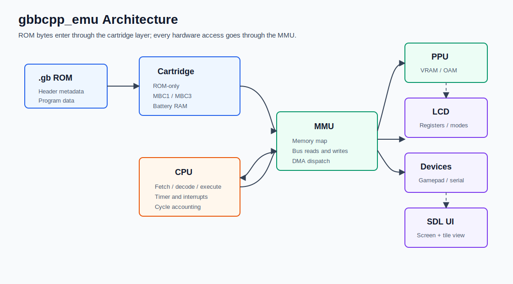
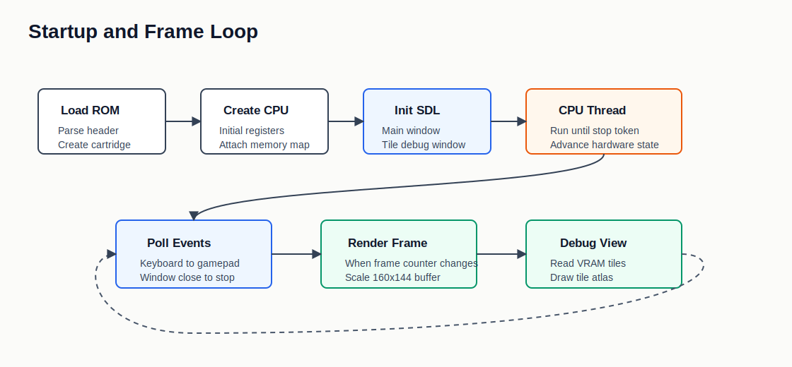
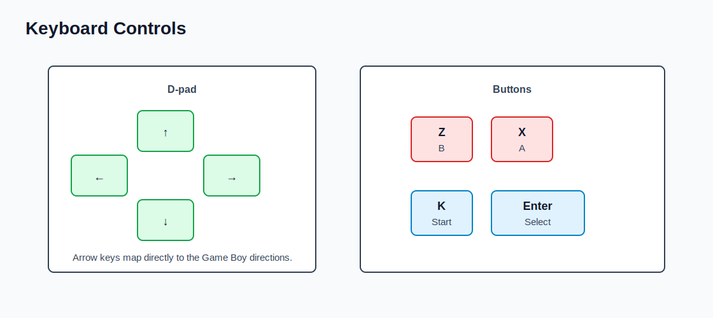

# gbbcpp_emu

A C++ Game Boy emulator project. 

The emulator loads a `.gb` ROM, runs the CPU on a worker thread, renders the LCD output through SDL2, and opens a second debug window that shows tile data from VRAM.



## Current Status

This project is a work in progress, but the core pieces are already in place:

- CPU instruction decoding and execution.
- MMU/bus routing for cartridge ROM/RAM, VRAM, WRAM, OAM, IO, HRAM, and interrupt enable.
- PPU/LCD timing model with OAM, transfer, HBlank, and VBlank modes.
- Timer, interrupts, DMA, gamepad input, and serial IO registers.
- Cartridge support for ROM-only, MBC1, and MBC3 cartridges.
- Battery-backed RAM loading/saving for supported cartridge types.
- SDL2 UI with main display and VRAM tile debug display.
- GoogleTest target for library tests.

The checked-in `roms/` directory contains public test ROMs that are useful for emulator validation. The `games/` directory is local/private content and should be treated separately from distributable project assets.

## How It Works

The executable starts by loading cartridge metadata from the ROM header and selecting a cartridge implementation. It then creates the CPU with the initial Game Boy register state, starts CPU execution on a `std::jthread`, and keeps the SDL UI loop on the main thread.



At runtime:

- The CPU fetches, decodes, and executes instructions.
- Memory reads and writes go through the MMU.
- The MMU forwards accesses to cartridge banking, RAM, PPU memory, LCD/device registers, DMA, and interrupt registers.
- The timer and PPU advance with CPU cycles.
- The PPU fills a 160x144 video buffer.
- SDL scales that buffer into the main window and renders a separate VRAM tile viewer.

## Controls



| Game Boy input | Keyboard |
| --- | --- |
| D-pad | Arrow keys |
| A | `X` |
| B | `Z` |
| Start | `K` |
| Select | `Enter` |

Close either SDL window to stop the emulator.

## Requirements

- CMake 3.26 or newer.
- Ninja.
- Clang with C++23 support.
- SDL2 development headers and libraries.
- SDL2_ttf development headers and libraries.
- Boost headers.
- OpenSSL development package.
- GoogleTest and fmt for the test target.

On Ubuntu/Debian-like systems, the package names are typically:

```sh
sudo apt install cmake ninja-build clang libsdl2-dev libsdl2-ttf-dev libboost-dev libssl-dev libgtest-dev libfmt-dev
```

## Build

Configure and build the release preset:

```sh
cmake --preset Release
cmake --build build-release
```

The emulator binary is produced at:

```text
build-release/app/emulator
```

## Run

Run the emulator with a Game Boy ROM:

```sh
./build-release/app/emulator roms/cpu_instrs.gb
```

Or use a local game ROM:

```sh
./build-release/app/emulator games/dr_mario.gb
```

The app opens two SDL windows:

- `gbemu_cpp`: scaled Game Boy screen.
- Debug tile window: VRAM tile viewer.

## Test

Build first, then run CTest from the release build directory:

```sh
ctest --test-dir build-release/lib/tests
```

You can also run the GoogleTest binary directly:

```sh
./build-release/lib/tests/test_gbemu_lib
```

The historical manual CPU-log comparison note was:

```sh
vimdiff <(head -n 200000 "log2.txt") <(head -n 200000 "/path/to/reference/log2.txt")
```

That workflow is not automated in the repository yet.

## Project Layout

```text
app/
  emulator.cpp       SDL app entry point and emulation loop
  gameboy_ui.h       SDL rendering, debug tile window, and keyboard input

lib/include/
  cartridge/         ROM header parsing, cartridge interface, MBC1/MBC3, battery save support
  cpu/               CPU context, instructions, interrupt handling, timer
  io/                LCD, gamepad, serial/device registers
  mmu/               Memory map, DMA, RAM
  ppu/               PPU state machine, tile fetch pipeline, OAM
  utils/             Logging and ROM loading helpers

lib/src/             Main library implementation
lib/tests/           GoogleTest target
roms/                Test ROMs
docs/images/         README diagrams
```

## Known Gaps Before Further Improvements

- Test coverage is minimal and does not yet encode the manual validation workflow.
- Cartridge support is focused on ROM-only, MBC1, and MBC3.
- Audio/APU emulation is not implemented.
- Some IO and memory edge cases are still logged as unsupported.
- The README diagrams describe the current implementation; they are not emulator screenshots.

## Suggested Next Steps

1. Add automated test ROM execution with pass/fail detection.
2. Capture real screenshots for `dmg-acid2.gb`, `cpu_instrs.gb`, and a small homebrew ROM.
3. Document compatibility by ROM and cartridge type.
4. Add CI for configure, build, and tests.
5. Split UI/debug rendering from emulation core so headless tests are easier to run.
